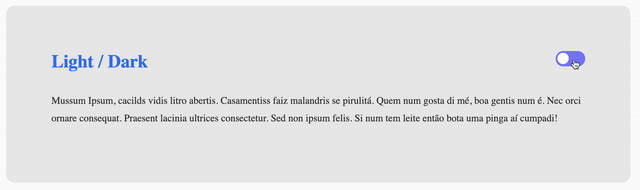

# Dark theme toggling example

## Introduction

This repository contains an example of how to implement a dark theme toggle feature controlled by Javascript.

This implementation was hardly inspired in [this video tutorial](https://www.youtube.com/watch?v=BvhYm0BOLvA).

## How to use

- Clone this repository
- Open the `index.html` file in your browser.

